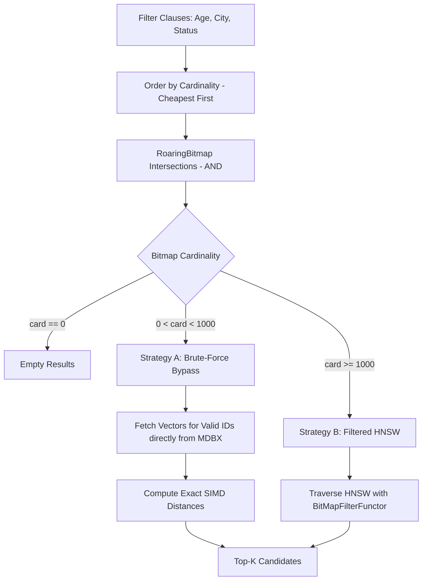
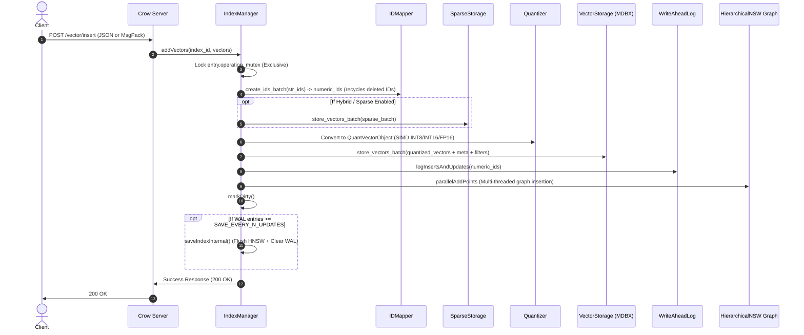
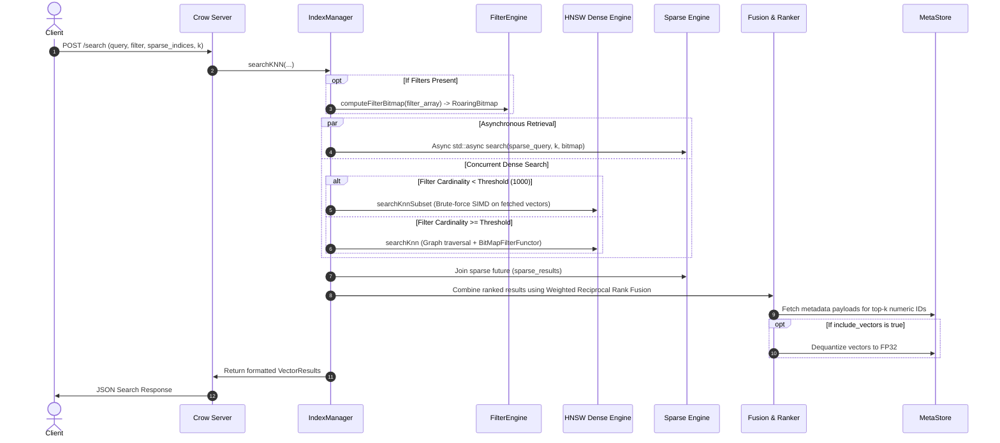

# Endee Architecture & Technical Design

This document provides a comprehensive technical overview of the **Endee** high-performance AI Search & Intelligence vector database platform. It explains the system architecture, component interactions, internal data structures, storage layout, concurrency models, and end-to-end request pipelines.

---

## Table of Contents

1. [High-Level Architecture](#1-high-level-architecture)
2. [Component Directory Structure](#2-component-directory-structure)
3. [Network & API Layer](#3-network--api-layer)
4. [Index Manager & Lifecycle Orchestration](#4-index-manager--lifecycle-orchestration)
5. [Dense Vector Search Engine (HNSW)](#5-dense-vector-search-engine-hnsw)
6. [Quantization & Hardware SIMD Acceleration](#6-quantization--hardware-simd-acceleration)
7. [Sparse Vector Search & Hybrid Fusion (RRF)](#7-sparse-vector-search--hybrid-fusion-rrf)
8. [Filtering Subsystem](#8-filtering-subsystem)
9. [Storage Engine & Persistence Model](#9-storage-engine--persistence-model)
10. [Index Rebuild & Backup Workflows](#10-index-rebuild--backup-workflows)
11. [End-to-End Execution Flows](#11-end-to-end-execution-flows)
12. [Concurrency & Locking Strategy](#12-concurrency--locking-strategy)

---

## 1. High-Level Architecture

Endee is designed as an embedded/standalone hybrid vector engine implemented in modern C++ (C++20). It decouples graph traversal from vector payload storage, achieves sub-millisecond retrieval through custom SIMD vectorization kernels, and natively integrates dense vector search, sparse term retrieval, and metadata filtering.

```mermaid
graph TD
    Client[Client / SDK / HTTP Request] -->|REST / JSON or MsgPack| API[Crow Web Microframework + Auth]
    
    subgraph Core Engine [Index Management & Memory]
        API --> IndexMgr[IndexManager (ndd.hpp)]
        IndexMgr --> LRU[Live Index Cache / TLS Lookup]
        IndexMgr --> WAL[Write-Ahead Log (WAL)]
        IndexMgr --> Rebuild[Index Rebuilder]
        IndexMgr --> Backup[BackupStore]
    end

    subgraph Query Execution & Scoring
        IndexMgr --> SearchRouter{Search Dispatcher}
        SearchRouter -->|Pre-Filter| FilterEngine[Filter Engine (Roaring Bitmaps)]
        SearchRouter -->|Dense Query| DensePath[Dense Engine]
        SearchRouter -->|Sparse Query| SparsePath[Sparse Engine (inverted_index)]
        
        FilterEngine -->|Card < 1000| BruteForce[Brute-Force Subset Search]
        FilterEngine -->|Card >= 1000| HNSWGraph[HNSW Graph (hnswlib)]
        DensePath --> HNSWGraph
        DensePath --> BruteForce
        
        DensePath --> SIMD[SIMD Distance Kernels: AVX2 / AVX512 / NEON / SVE2]
        SparsePath --> SparseScoring[BM25 / Sparse Dot Product]
        
        DensePath & SparsePath --> Fusion[Weighted RRF (Reciprocal Rank Fusion)]
    end

    subgraph Storage Layer [libmdbx Embedded Engine]
        HNSWGraph -.->|On-demand Vector Fetch| VStore[(Vector Storage: MDBX)]
        IndexMgr --> IDMap[(IDMapper: String <-> idInt)]
        IndexMgr --> MetaStore[(MetaStore: MsgPack Payloads)]
        IndexMgr --> FStore[(Filter Storage: MDBX)]
        IndexMgr --> SStore[(Sparse Storage: MDBX)]
    end
```

---

## 2. Component Directory Structure

| Path | Primary Responsibilities |
| :--- | :--- |
| [`src/main.cpp`](file:///c:/Projects/endee_test/src/main.cpp) | Crow web server, REST API routing, authentication middleware, payload serialization/deserialization, static UI asset serving. |
| [`src/core/ndd.hpp`](file:///c:/Projects/endee_test/src/core/ndd.hpp) | Central database coordinator (`IndexManager`), `CacheEntry` memory management, index CRUD, batch insert, hybrid search dispatch, autosave background loop, eviction. |
| [`src/core/rebuild.hpp`](file:///c:/Projects/endee_test/src/core/rebuild.hpp) / [`.cpp`](file:///c:/Projects/endee_test/src/core/rebuild.cpp) | Online background HNSW index rebuild and compaction with modified graph parameters ($M$, $ef_{construction}$) without re-uploading vectors. |
| [`src/hnsw/`](file:///c:/Projects/endee_test/src/hnsw/) | Modified HNSW algorithm (`hnswalg.h`), brute force subset search (`bruteforce.h`), distance space interfaces, visited list pool. |
| [`src/quant/`](file:///c:/Projects/endee_test/src/quant/) | Quantization system: FP32, FP16, INT16, INT8, and Binary quantization with explicit SIMD implementations for AVX2, AVX-512, ARM NEON, and ARM SVE2. |
| [`src/sparse/`](file:///c:/Projects/endee_test/src/sparse/) | Sparse vector engine (`sparse_storage.hpp`, `inverted_index.hpp` / `.cpp`, `sparse_vector.hpp`): blocked posting lists, BM25 scoring, dynamic compaction. |
| [`src/filter/`](file:///c:/Projects/endee_test/src/filter/) | High-performance pre-filtering (`filter.hpp`, `category_index.hpp`, `numeric_index.hpp`): hybrid bucket B+ trees, Roaring Bitmaps, first-write-wins typing. |
| [`src/storage/`](file:///c:/Projects/endee_test/src/storage/) | Persistence abstraction: `vector_storage.hpp` (raw vectors + metadata), `id_mapper.hpp` (ID mapping & recycling), `wal.hpp` (WAL), `index_meta.hpp` (global metadata), `backup_store.hpp` (tar archives). |
| [`src/server/auth.hpp`](file:///c:/Projects/endee_test/src/server/auth.hpp) | Token authentication, user privilege levels (Admin / Standard). |
| [`src/utils/`](file:///c:/Projects/endee_test/src/utils/) | Configuration settings (`settings.hpp`), logging macros (`log.hpp`), hardware CPU compatibility detection, system sanity preflight checks. |
| [`third_party/`](file:///c:/Projects/endee_test/third_party/) | Embedded dependencies: `crow` (HTTP), `asio` (async IO), `mdbx` (embedded transactional KV), `roaring_bitmap` (CRoaring), `msgpack`, `json` (nlohmann). |

---

## 3. Network & API Layer

The server uses **Crow**, an asynchronous C++ web microframework built on top of **Asio**.

### 3.1 Serialization
Endee supports dual content types:
- **`application/json`**: Used for developer ergonomics, debugging, and web dashboards.
- **`application/msgpack`**: Binary serialization using MessagePack. Used for production vector insertion and high-throughput ingestion pipelines, eliminating string parsing overhead.

### 3.2 Authentication & Multi-Tenancy
- **`AuthMiddleware`**: Intercepts requests. If `NDD_AUTH_TOKEN` is configured, it enforces the `Authorization: <token>` header.
- **Index Identification**: Indices are scoped per user in the format `<username>/<index_name>`.

### 3.3 Endpoints Summary
- **Lifecycle & Info**: `POST /api/v1/index/create`, `GET /api/v1/index/list`, `GET /api/v1/index/<string>/info`, `DELETE /api/v1/index/<string>/delete`.
- **Ingestion & Deletion**: `POST /api/v1/index/<string>/vector/insert`, `POST /api/v1/index/<string>/vector/get`, `DELETE /api/v1/index/<string>/vector/<string>/delete`, `DELETE /api/v1/index/<string>/vectors/delete`.
- **Search**: `POST /api/v1/index/<string>/search`.
- **Filtering**: `POST /api/v1/index/<string>/filters/update`.
- **Operations & Rebuild**: `POST /api/v1/index/<string>/rebuild`, `GET /api/v1/index/<string>/rebuild/status`.
- **Backups**: `POST /api/v1/index/<string>/backup`, `GET /api/v1/backups`, `POST /api/v1/backups/<string>/restore`, `GET /api/v1/backups/<string>/download`, `POST /api/v1/backups/upload`.

---

## 4. Index Manager & Lifecycle Orchestration

The central coordinator is `IndexManager` defined in [`src/core/ndd.hpp`](file:///c:/Projects/endee_test/src/core/ndd.hpp).

### 4.1 CacheEntry & In-Memory Representation
When an index is loaded into RAM, it is held as a `CacheEntry`:
```cpp
struct CacheEntry {
    std::string index_id;
    std::unique_ptr<hnswlib::HierarchicalNSW<float>> alg;
    std::shared_ptr<IDMapper> id_mapper;
    std::shared_ptr<VectorStorage> vector_storage;
    std::unique_ptr<ndd::SparseVectorStorage> sparse_storage;
    std::unique_ptr<WriteAheadLog> wal;
    bool is_dirty{false};
    bool cache_valid{true};
    std::shared_mutex operation_mutex;
};
```

### 4.2 Multi-Tier Cache Lookup (Thread-Local Storage + Global Map)
To avoid global lock contention during high concurrency:
1. **Thread-Local Storage (`per_thread_indices_`)**: Each thread retains `weak_ptr<CacheEntry>`. If the index is hot and `cache_valid` is true, it is locked without acquiring the global `indices_mutex_`.
2. **Global Shared Cache (`indices_`)**: If not found in TLS, a `std::shared_lock` is acquired on `indices_mutex_`.
3. **On-Demand Disk Load (`loadIndex`)**: If the index is not loaded in memory, `ensureLiveIndexCapacity()` runs, loads the HNSW graph file (`.idx`) and opens MDBX databases, and registers the entry in `indices_`.

### 4.3 Memory Management & Bounded Eviction
Because each live index opens multiple MDBX environments and allocates HNSW structures:
- The system enforces a maximum live index threshold (`MAX_LIVE_INDICES = 255`).
- When capacity is reached, `evictIfNeeded()` evaluates candidates via FIFO/LRU list (`indices_list_`).
- If an eviction candidate is dirty (`is_dirty == true`), it is safely flushed to disk (`saveIndexInternal()`) before removal from RAM.

### 4.4 Background Autosave Thread
An internal worker thread (`autosaveLoop`) runs every `AUTOSAVE_SLEEP_MINUTES`. Any index marked dirty whose last modification exceeds `SAVE_EVERY_N_MINUTES` is automatically flushed to disk, truncating the WAL.

---

## 5. Dense Vector Search Engine (HNSW)

The dense vector indexing is based on a heavily customized Hierarchical Navigable Small World (HNSW) graph implementation in [`src/hnsw/hnswalg.h`](file:///c:/Projects/endee_test/src/hnsw/hnswalg.h).

### 5.1 Decoupled Vector Storage Architecture
In standard HNSW implementations, the raw vector data is duplicated and stored directly inside each node of the graph in RAM.
**Endee decouples this:**
- The in-memory HNSW structure contains graph link lists (connectivity $M$) and internal numeric IDs.
- Vectors remain inside persistent MDBX storage (`VectorStorage`).
- On-demand vector loading is executed via lambda callbacks:
  - `VectorFetcher`: fetches a single vector into a temporary buffer.
  - `VectorFetcherBatch`: fetches multiple candidate vectors within a single MDBX read transaction for high-throughput batch evaluation.

### 5.2 Distance Spaces
Endee supports standard distance spaces in [`src/core/space.hpp`](file:///c:/Projects/endee_test/src/core/space.hpp):
- **Cosine Similarity** (`cosine`): Normalized inner product.
- **Euclidean Distance** (`l2`): Standard L2 distance squared.
- **Inner Product** (`ip`): Dot product.

---

## 6. Quantization & Hardware SIMD Acceleration

To minimize memory footprint and maximize CPU memory bandwidth, Endee implements a pluggable quantization architecture in [`src/quant/`](file:///c:/Projects/endee_test/src/quant/).

### 6.1 Supported Quantization Levels

| Level | Storage Per Dimension | Memory Reduction vs FP32 | Description |
| :--- | :--- | :--- | :--- |
| `FP32` | 32 bits (4 bytes) | 1x (Baseline) | Full IEEE 754 single precision float. |
| `FP16` | 16 bits (2 bytes) | 2x | IEEE 754 half precision float. Native CPU float16 arithmetic. |
| `INT16` | 16 bits (2 bytes) | 2x | Dynamic range 16-bit integer quantization with scale factor. |
| `INT8` | 8 bits (1 byte) | 4x | Dynamic symmetric 8-bit integer quantization with scale factor. Default for high performance. |
| `BINARY` | 1 bit (0.125 bytes) | 32x | 1-bit quantization; distances computed via Hamming distance (POPCOUNT). |

### 6.2 SIMD Dispatch & Runtime Hardware Specialization
All similarity and distance routines are registered via `QuantizerDispatch` and compiled for specific instruction sets:
- **x86_64**: AVX2 (`-mavx2 -mfma -mf16c`) and AVX-512 (`-mavx512f -mavx512bw -mavx512vnni -mavx512fp16 -mavx512vpopcntdq`).
- **ARM / AArch64**: NEON (`+fp16+dotprod`) and SVE2.
- **Preflight Compatibility**: During server startup, `system_sanity` verifies that the running CPU supports the SIMD instructions required by the compiled binary, preventing `SIGILL` crashes.

---

## 7. Sparse Vector Search & Hybrid Fusion (RRF)

Endee supports sparse vector representations (such as BM25, SPLADE, or learned sparse weights) for keyword and lexical matching.

### 7.1 Sparse Inverted Index (`src/sparse/`)
- **Raw Storage (`sparse_docs`)**: Maps `doc_id` to packed `(term_id, fp16_weight)` arrays.
- **Blocked Postings (`blocked_term_postings`)**: Inverted index mapping `(term_id << 32) | block_nr` to blocks of posting records.
- **Dynamic Compaction**: When deletions accumulate past `INV_IDX_COMPACTION_TOMBSTONE_RATIO`, posting lists are automatically compacted.

### 7.2 Hybrid Search & Asynchronous Concurrent Execution
When a hybrid query containing both dense and sparse vectors arrives:
1. **Parallel Execution**:
   - Dense vector retrieval begins on the main worker thread.
   - Sparse vector retrieval is simultaneously dispatched via `std::async(std::launch::async, ...)` on a thread pool.
2. **Weighted Reciprocal Rank Fusion (RRF)**:
   The ranked outputs from both pipelines are merged using:
   $$\text{Score}(d) = w_{\text{dense}} \cdot \frac{1}{k_{\text{rrf}} + \text{rank}_{\text{dense}}(d) + 1} + w_{\text{sparse}} \cdot \frac{1}{k_{\text{rrf}} + \text{rank}_{\text{sparse}}(d) + 1}$$
   - $w_{\text{dense}}$ and $w_{\text{sparse}}$ defaults to $0.5$.
   - $k_{\text{rrf}}$ defaults to $60.0$.

---

## 8. Filtering Subsystem

Endee utilizes an adaptive **Pre-Filtering** engine built with **CRoaring (Roaring Bitmaps)**, documented in [`src/filter/`](file:///c:/Projects/endee_test/src/filter/) and [`docs/filter.md`](file:///c:/Projects/endee_test/docs/filter.md).



### 8.1 Category Filters
- Stored as inverted indices in MDBX with key format `FieldName:Value`.
- Values are serialized Roaring Bitmaps of internal `idInt` document identifiers.
- Supports exact match and `$in` list unions.

### 8.2 Numeric Filters (Hybrid Bucket B+ Tree)
- Stored in MDBX using key `[FieldID] + [Base_Value_32bit]` with big-endian encoding (preserving float/int sort order).
- **Summary Bitmap**: Contains the pre-computed union of all IDs in the bucket. For queries covering a full bucket range, IDs are retrieved in $O(1)$ time without examining data values.
- **Data Arrays**: Compressed 16-bit deltas scanned using SIMD for partial boundary matches.

### 8.3 Adaptive Execution Strategy
- **Small Candidate Set (< 1,000 IDs)**: Bypasses HNSW graph traversal entirely. The engine fetches candidate vectors directly from MDBX and performs brute-force distance calculation.
- **Large Candidate Set ($\ge$ 1,000 IDs)**: Passes the bitmap into HNSW traversal wrapped in a `BitMapFilterFunctor`.

---

## 9. Storage Engine & Persistence Model

Endee relies on **libmdbx** (an advanced, crash-resilient embedded B-tree storage engine) for zero-copy memory-mapped file persistence.

```
data_dir/
├── global_meta/                      <-- Global index catalogue (MetadataManager)
│   ├── mdbx.dat
│   └── mdbx.lck
└── <username>/
    └── <index_name>/
        ├── wal.bin                   <-- Write-Ahead Log
        ├── ids/                      <-- IDMapper database (String ID <-> idInt)
        │   └── mdbx.dat
        ├── vectors/                  <-- Dense vector store & HNSW graph
        │   ├── default.idx           <-- Persisted HNSW graph
        │   └── mdbx.dat              <-- Raw quantized vector payloads
        ├── meta/                     <-- Payload metadata (MsgPack)
        │   └── mdbx.dat
        ├── filters/                  <-- Numeric & Category filter indices
        │   └── mdbx.dat
        └── sparse/                   <-- Sparse docs & inverted index blocks
            └── mdbx.dat
```

### 9.1 ID Mapping & Deleted ID Recycling (`IDMapper`)
- Vector operations expose string IDs (e.g. `"doc_9921"`).
- Internally, all components (HNSW, Roaring Bitmaps, MDBX keys) use contiguous 32-bit unsigned integers (`ndd::idInt`).
- `IDMapper` stores the bidirectional mapping and maintains a set of tombstoned IDs so deleted slots are immediately recycled during subsequent batch inserts.

### 9.2 Write-Ahead Logging (WAL)
- Operations are written to `wal.bin`: `VECTOR_ADD`, `VECTOR_UPDATE`, `VECTOR_DELETE`.
- On crash recovery during server boot, `recoverFromWAL()` reads unprocessed log entries, synchronizes the HNSW graph with MDBX, reclaims orphan IDs, and issues a clean index snapshot.

---

## 10. Index Rebuild & Backup Workflows

### 10.1 Online Index Rebuild (`src/core/rebuild.hpp`)
Allows reconfiguring HNSW graph hyper-parameters ($M$, $ef_{construction}$) for existing datasets:
1. Rebuild job executes asynchronously in a detached background thread.
2. Reads vectors sequentially from persistent `VectorStorage` using an MDBX cursor.
3. Constructs a new HNSW graph in a temporary file (`.tmp.idx`).
4. Atomically replaces the old graph file on disk and hot-swaps the in-memory algorithm instance.
5. Real-time progress is observable via `GET /api/v1/index/<string>/rebuild/status`.

### 10.2 Backup System (`src/storage/backup_store.hpp`)
- Produces self-contained `.tar` archives containing the complete index directory (vectors, HNSW graph, MDBX data, metadata, filters).
- Thread-safe coordination: Acquires `operation_mutex` on the index, issues an internal flush (`saveIndexInternal()`), archives files using `libarchive`, and releases the lock.
- Supports streaming downloads and uploads via HTTP.

---

## 11. End-to-End Execution Flows

### 11.1 Vector Ingestion Pipeline (`POST /api/v1/index/<name>/vector/insert`)



### 11.2 Search Execution Pipeline (`POST /api/v1/index/<name>/search`)



---

## 12. Concurrency & Locking Strategy

Endee is engineered for high read concurrency while ensuring ACID durability:

1. **Global Index Lock (`indices_mutex_`)**:
   - `std::shared_mutex` protecting the registry of loaded indices.
   - Shared for read/lookup; exclusive when creating, loading, evicting, or deleting indices.
2. **Thread-Local Index Cache (`per_thread_indices_`)**:
   - Bypasses global lock contention for read-heavy operations on active indices.
3. **Per-Index Operation Lock (`CacheEntry::operation_mutex`)**:
   - `std::shared_mutex` per index instance.
   - Writers (insertions, updates, deletions, backups, flushes) acquire an exclusive lock.
   - Readers access index memory without starving behind long-running background tasks.
4. **HNSW Link List Locks (`linkListLocks_`)**:
   - Array of fine-grained mutexes (`MAX_LINK_LIST_LOCKS = 65,536`) inside the HNSW graph.
   - Prevents node link race conditions during concurrent multi-threaded point insertion (`parallelAddPoints`).
5. **libmdbx Transactions**:
   - Full ACID transaction semantics. MDBX allows multiple concurrent read transactions alongside single write transactions per database environment.
